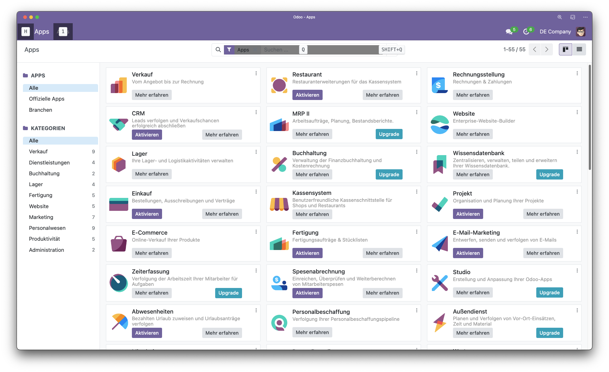

# Odoo example setup

This repository contains an example setup for Odoo development. It includes a sample module, a sample theme, and a sample theme extension.



## Setup

1. Clone this repository.
2. Run

    ```bash
    docker compose up -d
    ```.

3. Open your browser and go to <http://localhost:8069>.
4. Log in with the following credentials:
   - Username: `admin`
   - Password: `admin`
